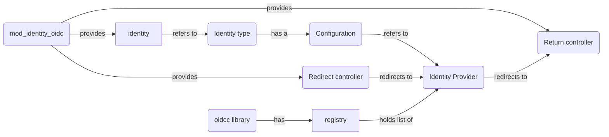

# mod_sso_openidc

OpenID Connect single sign-on identity support for the Zotonic framework.

## Scope

This module provides Zotonic log-on Identities for OpenID Connect (OIDC) identity
services, to enable users to log on using an external single sign-on (SSO) account.

## Configuration

In the admin there is a menu item _Auth_ > _OpenID Connect Providers_.

There it is possible to configure the various identity providers.

You can use https://auth0.com for creating a test identity provider.
They also have a playground to get insights in the OpenID Connect flow.

## Dependencies and installation

For handling of certificates, jwt tokens and other crypto tasks this module aims
to use the latest stable release of https://github.com/erlef/oidcc

Current release used: `v3.2` or later.

### Adding oidcc to zotonic as a dependency

Check out the repository in `apps_user/` or add it as a dependency in `rebar.config`.

## About OpenID Connect

OpenID Connect specs are at https://openid.net/specs/openid-connect-core-1_0.html

Three authentication flows exist:
- Authorization Code Flow (uses a "code" in the authorization response; "response_type" = "code")
- Implicit Flow (has an "id_token" and optionally "token" in the response; "response_type" = "id_token" or "id_token token")
- Hybrid Flow (uses a combination of "code", and either "id_token" or "token", or both)

We use **Authorization Code Flow*** because this is the preferred path when a client secret
can be securily kept, in this case on our Zotonic server, see the specs in section 3.1:

> The Authorization Code Flow returns an Authorization Code to the Client, which
> can then exchange it for an ID Token and an Access Token directly. This provides
> the benefit of not exposing any tokens to the User Agent and possibly other
> malicious applications with access to the User Agent. The Authorization Server
> can also authenticate the Client before exchanging the Authorization Code for
> an Access Token. The Authorization Code flow is suitable for Clients that can
> securely maintain a Client Secret between themselves and the Authorization Server.

Section 3.1.1 lists the process:

1. Client prepares an Authentication Request containing the desired request parameters.
2. Client sends the request to the Authorization Server.
3. Authorization Server Authenticates the End-User.
4. Authorization Server obtains End-User Consent/Authorization.
5. Authorization Server sends the End-User back to the Client with an Authorization Code.
6. Client requests a response using the Authorization Code at the Token Endpoint.
7. Client receives a response that contains an ID Token and Access Token in the response body.
8. Client validates the ID token and retrieves the End-User's Subject Identifier.

## Technical background

### Integration into the Zotonic login/signup process

1. `mod_authentication` observes `observe_auth_validated` notifications, sent by the
   `do_auth_user/2` function in `mod_identity_oidc_or`. This function sets up an
   `auth_validated` record, containing the following fields:
   - `service` - `mod_sso_openidc`
   - `service_uid` - Provider name and Subject ID (openid `sub` claim, user id unique per provider)
   - `service_props` - Contents of the token holding the authentication claims
   - `props` - Zotonic Person properties derived from the claims
2. The module `mod_authentication` looks up the user identity (`service_uid`) in the `identity` table
3. if not found, the module tries a signup by sending a `signup` notification, with the
   `email` claim as email identity in the `signup_props` field.

### Authentication claims

This module expects to extract the following claims from the authentication
token returned by the ID Provider and maps them to Zotonic `auth_validated`
notification fields:

- `sub` => `service_uid`
- `email` => `props.email`
- `given_name` => `props.name_first`
- `family_name` => `props.name_surname`
- `name` => `props.title`

### Implementation

## Notes on Identities

- The SSO identities are stored in an identity with type `mod_sso_openidc` and key
  `myprovider$subject` where _myprovider_ is the name given to the OpenIDC configuration
  used, and _subject_ is the unique id of the user at the provider.
- The module `mod_admin_identity` automatically creates email identities if an email
  address is added to a `person` or `institution` resource.
- Validation of uniqueness of email address with signup should only fail on
  verified email addresses
- Signup via SSO should imply a verified email address (if the login claims
  returned contain an email address).
